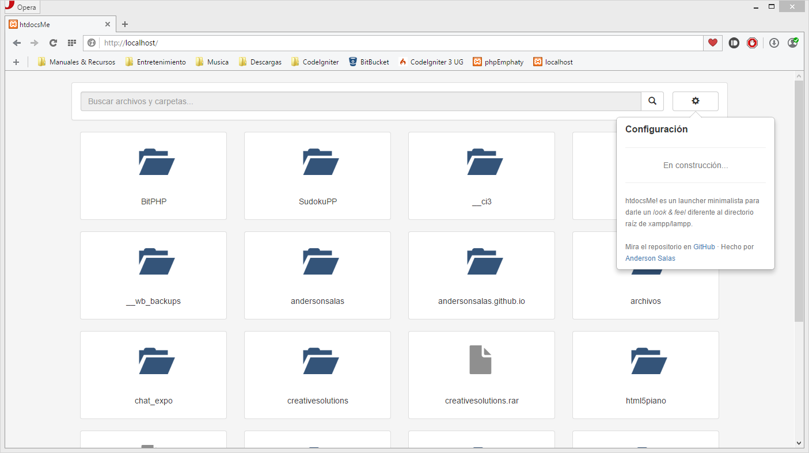

# htdocsMe
Un launcher minimalista para la carpeta raíz de xampp/lampp (En desarrollo...)

## Uso ##
Simplemente copia el archivo index.php en el directorio raíz de xampp (Normalmente es htdocs, por eso el nombre)

## Traducciones/Translations:

[Português (Brasil)](translations/pt_BR)  - por Manuel Santos
