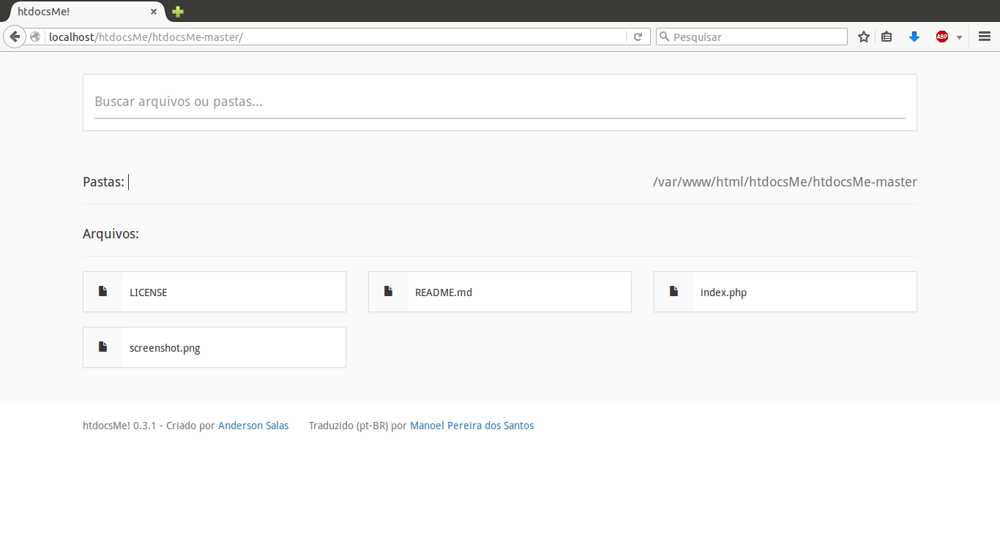

# htdocsMe
Um lançador minimalista para a pasta raiz do xampp / lampp (Em desenvolvimento ...)

## Uso ##
Basta copiar o arquivo index.php no diretório raiz do xampp (normalmente htdocs, daí o nome)
